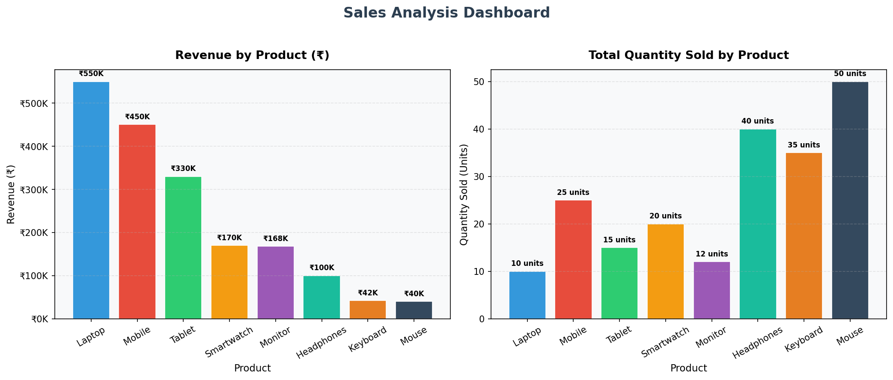

# 📊 TASK 7: SQLite Sales Analysis using Python

> **DataX Labs — Data Analyst Internship**
> **Task 7:** Get Basic Sales Summary from a Tiny SQLite Database using Python

---

## 🎯 Objective

Use SQL inside Python to pull simple sales information (like total quantity sold and total revenue) from a SQLite database, and display the results using `print` statements and a `matplotlib` bar chart.

---

## 📁 Dataset

A small SQLite database file `sales_data.db` was created with a single table called **`sales`**.

### Table Structure:

| Column   | Type    | Description                  |
|----------|---------|------------------------------|
| id       | INTEGER | Auto Increment Primary Key   |
| product  | TEXT    | Name of the product          |
| quantity | INTEGER | Number of units sold         |
| price    | REAL    | Price per unit (₹)           |

### Sample Data (8 Products):

| Product    | Quantity | Price (₹) |
|------------|----------|-----------|
| Laptop     | 10       | 55,000    |
| Mobile     | 25       | 18,000    |
| Headphones | 40       | 2,500     |
| Tablet     | 15       | 22,000    |
| Smartwatch | 20       | 8,500     |
| Keyboard   | 35       | 1,200     |
| Mouse      | 50       | 800       |
| Monitor    | 12       | 14,000    |

---

## 🔍 SQL Queries Used

### Query 1 — Product-wise Sales Summary:
```sql
SELECT
    product,
    SUM(quantity)         AS total_qty,
    SUM(quantity * price) AS revenue
FROM sales
GROUP BY product
ORDER BY revenue DESC
```

**What does GROUP BY do?**
`GROUP BY` groups all rows with the same product name together, and applies aggregate functions like `SUM()` to calculate the total quantity and revenue for each product.

**How is Revenue calculated?**
`SUM(quantity * price)` — multiplies quantity by price for every row, then adds them all up to get the total revenue per product.

### Query 2 — Overall Business Summary:
```sql
SELECT
    COUNT(DISTINCT product) AS total_products,
    SUM(quantity)           AS total_units_sold,
    SUM(quantity * price)   AS total_revenue
FROM sales
```

---

## 📤 Output

### Product-wise Summary:
```
   product  total_qty   revenue
    Laptop         10  550000.0
    Mobile         25  450000.0
    Tablet         15  330000.0
Smartwatch         20  170000.0
   Monitor         12  168000.0
Headphones         40  100000.0
  Keyboard         35   42000.0
     Mouse         50   40000.0
```

### Overall Business Summary:
```
Total Products    : 8
Total Units Sold  : 207
Total Revenue     : ₹18,50,000.00
```

---

## 📊 Chart

Two bar charts were created using `matplotlib`:

1. **Revenue by Product** — Shows which product earned the most revenue
2. **Quantity Sold by Product** — Shows which product sold the most units



Both charts are saved as `sales_chart.png`.

---

## 🛠️ Tools & Libraries Used

| Tool / Library | Purpose                                          |
|----------------|--------------------------------------------------|
| `sqlite3`      | Connect to SQLite database (Python built-in)     |
| `pandas`       | Load SQL query results into a DataFrame          |
| `matplotlib`   | Create bar charts for visualization              |

---

## 🚀 How to Run

```bash
# Step 1: Clone the repository
git clone https://github.com/YOUR_USERNAME/TASK-7-SQLITE-SALES-ANALYSIS.git
cd TASK-7-SQLITE-SALES-ANALYSIS

# Step 2: Install required libraries
pip install -r requirements.txt

# Step 3: Run the script
python task7.py
```

---

## 💡 Interview Questions & Answers

**Q1: How did you connect Python to a database?**
Used the built-in `sqlite3` module: `conn = sqlite3.connect("sales_data.db")`. If the file doesn't exist, SQLite creates it automatically.

**Q2: What SQL query did you run?**
`SELECT product, SUM(quantity), SUM(quantity * price) FROM sales GROUP BY product` — this fetches total quantity and revenue grouped by each product.

**Q3: What does GROUP BY do?**
It groups all rows that share the same product name and allows aggregate functions like `SUM()` and `COUNT()` to be applied to each group separately.

**Q4: How did you calculate revenue?**
Using `SUM(quantity * price)` — for each row, quantity is multiplied by price, and all values are summed up to get total revenue per product.

**Q5: How did you visualize the result?**
Used `matplotlib` to create two bar charts — one for revenue and one for quantity sold — both displayed in a single figure and saved as a PNG file.

**Q6: What does pandas do in your code?**
`pd.read_sql_query()` loads the SQL result directly into a DataFrame, which makes it easy to print, filter, and pass to matplotlib for plotting.

**Q7: What is the benefit of using SQL inside Python?**
You can combine database querying, data processing, and visualization all in one script — making automation and reporting much easier.

**Q8: Could you run the same SQL query directly in DB Browser for SQLite?**
Yes! Open `sales_data.db` in DB Browser for SQLite, go to the "Execute SQL" tab, paste the query, and run it to see the same results.

---

## 📂 Project Structure

```
TASK-7-SQLITE-SALES-ANALYSIS/
│
├── task7.py                   ← Main Python Script
├── sales_data.db              ← SQLite Database file
├── sales_chart.png            ← Generated Bar Chart
├── requirements.txt           ← Python dependencies
├── .gitignore                 ← Files to ignore in Git
├── README.md                  ← Project documentation
└── screenshots/
    ├── chart.png              ← Chart screenshot
    ├── output.png             ← Output screenshot
    └── terminal_output.txt    ← Terminal output log
```

---

## ✅ Conclusion

By completing this task, I learned how to:
- Create a SQLite database and insert data using Python
- Write SQL queries to summarize sales data by product
- Use `GROUP BY` to perform aggregate calculations
- Load SQL results into a pandas DataFrame
- Visualize data using matplotlib bar charts

This task provided a solid foundation for real-world data analysis — combining databases, SQL, Python, and visualization in a single workflow.

---

*Submitted by:SARAGONDA AYYASAMULU
*Internship: DataX Labs — Data Analyst Internship*
